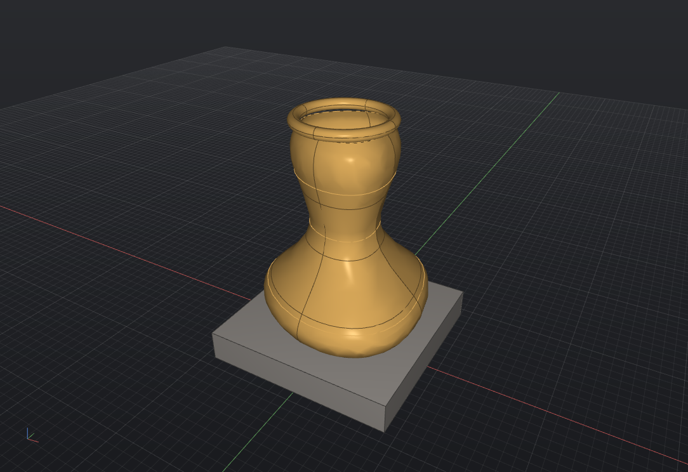

# Serpentine3D

**An open-source NURBS surface modeller for Linux, with native AI integration via MCP.**

Serpentine3D (`serp3d`) is a freeform surface modeller in the spirit of Rhinoceros 3D —
BREP/NURBS geometry on the OpenCASCADE kernel, not meshes. It is built for set
designers, architects, and industrial designers who want a genuine Rhino-style
workflow on Linux: a command line that prompts for input, layers, object snaps to
a construction plane, STEP/OBJ interchange, and a dark, focused interface.

Named for the serpentine stone of Zimbabwean Shona sculpture, and for the
S-curve at the heart of NURBS geometry.



## Why

- **No genuine open-source NURBS modeller exists for Linux.** FreeCAD is
  parametric CAD; Blender is mesh-based. Serpentine3D fills the freeform
  surface-modelling gap.
- **First CAD tool with native AI integration.** The bundled MCP server lets
  Claude (or any MCP client) see your viewport, create geometry, run any
  command, and manage the scene.

## Install

Requires Python 3.10+ on Linux with OpenGL 3.3.

```bash
git clone <this-repo> && cd Serpentine3D
python3 -m venv .venv
.venv/bin/pip install -e .
.venv/bin/serp3d        # launch
```

The OpenCASCADE kernel ships as pip wheels (`cadquery-ocp`) — no conda, no
system packages.

## The command line

Everything works Rhino-style: type a command, answer its prompts. Prompts accept
typed coordinates (`10,5,0`, relative `@5,0,0`) or viewport clicks on the
construction plane. `Tab` completes command names, `Up`/`Down` recall history,
`Enter` on an empty line repeats the last command, `Escape` cancels.

| | Commands |
|---|---|
| **Curves** | `line` `polyline` `curve` (interpolated NURBS) `circle` `arc` `ellipse` `rectangle` `helix` `textobject` `blendcrv` `project` `pull` `intersect` |
| **Surfaces** | `extrude` `revolve` `loft` `sweep1` `sweep2` `planarsrf` `patch`/`networksrf` `offsetsrf` `unrollsrf` |
| **Solids** | `box` `sphere` `cylinder` `cone` `torus` `filletedge` `chamferedge` (both pick edges directly; fillets chain and take `start,end` variable radii) `shell` `cap` `contour` `booleansplit` `pushpull` |
| **Deform** | `twist` `taper` `bend` `flow` (curve-to-curve) `extend` `matchcrv` |
| **Booleans** | `booleanunion` `booleandifference` `booleanintersection` |
| **Transform** | `move` `copy` `rotate` `scale` `scalenu` `mirror` `array` |
| **Edit** | `join` `explode` `trim` `split` `offset` `fillet` `rebuild` `pointson`/`pointsoff` (control points, curves *and* surfaces) `delete` `hide` `show` `rename` `undo` `redo` |
| **Select** | `selall` `selnone` `selcrv` `selsrf` `selsolid` `sellayer` `selname` `sellast` `invert` `isolate` `unisolate` |
| **Organise** | `group`/`ungroup` `lock`/`unlockall` `block` `insert` `blocklist` `count` |
| **Camera** | `camera` (lens mm, cinema sensors, placement, 2.39/1.85 frame guides) `units` `cplane` |
| **Array** | `array` (grid) `arraypolar` `arraypath` (along a curve) |
| **Analysis** | `distance` `length` `area` `volume` `curvature` `zebra` `curvaturegraph` (combs) `draftanalysis` |
| **View** | `top` `front` `right` `perspective` `4view`/`1view` `zoomextents` `wireframe` `shaded` `ghosted` `rendered` `technical` `grid` `snap` |
| **Render** | `material` (Matte/Plastic/Metal/Glass/custom PBR — flows into GLB/USD export) `rendered` |
| **Layers** | `layer` (new/current/show/hide/rename/weight) — or use the Layers panel |
| **Meshes** | heavy OBJ/3DM props stay native meshes (instant display); `meshtobrep` / `breptomesh` convert |
| **Files** | `new` `open` `save` `import` `export` (`.serp` is a zip container with thumbnail + metadata) |
| **Live** | `recordhistory` — loft/extrude/revolve outputs rebuild when their input curves are edited |

Most commands have Rhino-compatible aliases (`l`, `pl`, `c`, `m`, `co`, `mi`, ...).
Command options appear as **clickable chips** under the prompt
(`Cap=Yes`, `BothSides=No`, `Style=Normal`) and can be typed
Rhino-style (`cap=n`) at any moment without losing your place; numeric
prompts show a live **gold ghost preview** of the result while you
type. `help` (or F1) opens a searchable command reference. Arrow keys
nudge the selection along the CPlane (Shift ×10, Ctrl ×0.1).

### Navigation & shortcuts

- **Middle mouse** orbit · **Shift+Middle** pan · **Scroll** zoom
- **F1–F4** top/front/right/perspective · **Ctrl+E** zoom extents · **F7** grid
- **Ctrl+Z / Ctrl+Y** undo/redo · **Ctrl+A** select all · **Delete** delete selection
- **Ctrl+S / Ctrl+O / Ctrl+N** save/open/new
- Click to select (Shift-click adds, Ctrl-click removes), click empty space
  to deselect
- **Box selection**: drag left-to-right for a *window* (fully enclosed,
  gold box), right-to-left for a *crossing* (anything touched, white box);
  Shift adds, Ctrl removes
- **Control points**: `pointson` (F10) shows CVs on curves — drag a CV to
  edit the curve live; `pointsoff` (F11) hides them
- **Object snaps** — end, mid, center, quadrant, intersection,
  perpendicular, and nearest-point, each with a distinct cursor marker.
  Toggle types on the **osnap bar** under the command line, or in
  Settings. `gridsnap` snaps picked points to the grid
- Launch with a file: `serp3d model.serp` (or any importable format)

## Drafting & documentation

Serpentine3D has a full two-space drafting workflow — model in 3D, document
in 2D, print to PDF — without leaving the app:

- **Layouts** (`layout`): paper-space sheets (A4–A0, Letter, Tabloid or
  custom) with tabs at the bottom of the viewport: `[Model] [Sheet 1] …`
- **Detail views** (`detail`): live windows into the model placed on the
  sheet — pick two corners, a view direction (top/front/right/…/perspective)
  and a scale (`1:10`, `1:50`, …). Double-click a detail to *enter* it,
  then pan (nav-button drag) and zoom (wheel changes the scale); click
  outside to exit. `detailscale`, `detailmode`, `detaillock`,
  `detailborder`, `detaildelete` manage the active detail.
- **Hidden-line rendering**: each detail can be *technical* (hidden lines
  removed), *hidden* (dashed hidden lines), *wireframe* or *shaded* —
  powered by OCCT's HLR engine, isolated in a worker process so degenerate
  geometry can never crash the app. The same engine drives the model-space
  `technical` display mode.
- **`make2d`**: project the current view (or a selection) into real,
  editable 2D curves on `Make2D visible` / `Make2D hidden` layers.
- **Annotations**: multiline `text`, `leader`, `dim` / `dimradius` /
  `dimdiameter` / `dimangle`, `hatch` (pick corners or **Mode=Region**
  to click inside detail linework), `scalebar`, `titleblock`,
  `sheetindex` and per-sheet `revision` tables. Everything on a sheet
  is selectable — drag to move, grips resize detail frames, Delete
  removes, `annotedit` edits — and dimensions picked inside a detail
  are **associative**: they re-project when the detail pans or
  rescales. `dimstyle` manages named text/arrow styles.
- **`exportpdf`** (Ctrl+P): true vector PDF — linework stays crisp at any
  zoom; shaded details are embedded as rendered images. Layouts save/load
  with the `.serp` file.

### The gumball

Select anything and a **gumball** appears: drag the arrows to move along
an axis, the pads to move in a plane, the circles to rotate (Shift snaps
to 15°), the square knobs to scale along an axis (Shift = uniform).
Alt-drag moves a copy. Escape cancels a drag. `gumball` toggles it.

### Units

`units` sets the document units (mm/cm/m/in/**feet-and-inches**) with an
optional model rescale. Every prompt then accepts unit input — `3'6"`,
`2' 4 1/2"`, `30cm`, `1.5in` — and coordinates support polar entry
(`10<45`) and Shift-ortho constraint while picking.

### Scripting & automation

- **Python console** (Tools menu, Ctrl+`): the live scene, geometry
  builders and the full API in an interactive session.
- **`serpentine3d.scripting.Document`**: the same power headless —
  `doc.add(geo.make_box(...))`, `doc.run("filletedge", [...])`,
  `doc.export("part.step")`.
- **`serp3d-batch script.py`**: run scripts from the command line / CI
  with `doc`, `geo` and `args` predefined. No display needed.
- **Autosave & crash recovery**: every 5 minutes (configurable); on
  launch after a crash Serpentine3D offers to restore the autosave.
- Drop a `~/.config/serpentine3d/template.serp` to start every new
  document from your own template (units, layers, title blocks).

### Settings

**Tools → Settings** (Ctrl+,) — five flat pages, changes apply instantly:

- **Mouse** — orbit with the middle *or right* mouse button, scroll
  direction, orbit/zoom speed
- **Keyboard** — bind any key to any command; import from a text file
  (`F5 zoomextents` per line) or JSON
- **Aliases** — custom command aliases; **imports Rhino alias exports**
  (Options → Aliases → Export) and maps known commands automatically
- **Object Snaps** and **Display** (grid size)

Settings live in `~/.config/serpentine3d/settings.json`.

## File formats

| Format | Import | Export | Notes |
|---|---|---|---|
| `.serp` | ✓ | ✓ | Native: JSON scene + embedded binary BREP |
| `.step` / `.stp` | ✓ | ✓ | Exact BREP exchange via OCCT |
| `.3dm` | ✓ | ✓ | Rhino: exact NURBS curves both ways; breps/surfaces import as untrimmed NURBS faces, export as meshes; layers preserved |
| `.obj` | ✓ | ✓ | Tessellated mesh with `.mtl` colours |
| `.dxf` | ✓ | ✓ | Curves/meshes with layers; layout sheets export at paper scale |
| `.svg` | ✓ | ✓ | Paths import as curves (béziers exact); layouts export as vector SVG |
| `.glb` | | ✓ | Binary glTF with materials (Unreal/Blender/web) |
| `.usda` | | ✓ | USD for virtual-production pipelines |

## MCP server (AI integration)

Serpentine3D exposes its full modelling surface as MCP tools. Start the app,
then register the server with your MCP client:

```bash
claude mcp add serpentine3d -- /path/to/.venv/bin/serp3d-mcp
```

Tools: `serp_scene_info`, `serp_screenshot` (returns an image of the viewport),
`serp_create_curve`, `serp_create_surface`, `serp_boolean`, `serp_transform`,
`serp_select`, `serp_command` (run any command with its interactive inputs),
`serp_layers`, `serp_import`, `serp_export`, `serp_measure`, `serp_undo`,
`serp_viewport`.

The combination of `serp_screenshot` and `serp_command` means an AI assistant
can model alongside you: it sees what you see and can operate every tool the
command line offers. The bridge is a localhost-only JSON-RPC socket
(`~/.serpentine3d/rpc.port`); set `SERP3D_NO_RPC=1` to disable it.

## Architecture

```
serpentine3d/
├── core/          # kernel layer: geometry builders, tessellation,
│                  #   scene graph, layers, selection, undo history
├── commands/      # generator-based interactive commands (Rhino-style
│                  #   prompt protocol, shared by GUI + MCP)
├── ui/            # Qt: GL viewport, command line, panels, dark theme
├── fileio/        # .serp / STEP / OBJ
├── mcp_server/    # stdio MCP server -> RPC bridge
├── api.py         # programmatic API over a running session
└── rpc.py         # localhost JSON-RPC bridge
```

Geometry is exact BREP on OpenCASCADE 7.9 (via the `OCP` pybind11 bindings);
the viewport tessellates on demand with trim-aware isocurve display. Commands
are Python generators that yield typed input requests — the same command code
serves typed input, viewport clicks, and MCP calls.

## Plugins

Drop a `.py` file into `~/.serpentine3d/plugins/` defining
`serpentine3d_plugin(ctx)`, or ship a package with a
`serpentine3d.plugins` entry point — plugins register first-class
commands (with prompts, osnaps, undo and MCP support for free) and
menu items. See `docs/scripting.md`.

## Development

```bash
.venv/bin/pip install -e ".[dev]"
.venv/bin/pytest            # unit tests (geometry, scene, commands, file I/O)
```

## License

MIT
