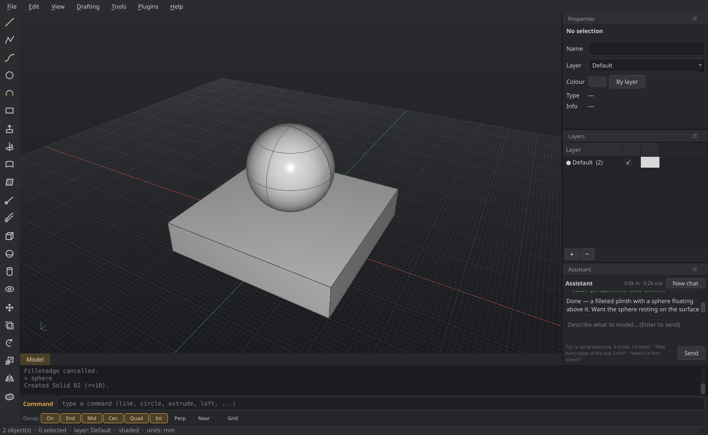

# AI / MCP integration

Serpentine3D ships an [MCP](https://modelcontextprotocol.io) server so AI
assistants can drive the modeller: create geometry, run any command,
inspect and screenshot the scene.

<figure markdown="span">
  { width="820" }
  <figcaption>The in-app assistant builds real geometry in your scene and can
  see the viewport to check its own work.</figcaption>
</figure>

## Wiring it up

With the GUI running (it opens a local RPC bridge automatically), add
to your MCP client config — e.g. Claude Code:

```bash
claude mcp add serpentine3d -- /path/to/.venv/bin/serp3d-mcp
```

or in `claude_desktop_config.json`:

```json
{
  "mcpServers": {
    "serpentine3d": { "command": "/path/to/.venv/bin/serp3d-mcp" }
  }
}
```

The MCP server finds the running GUI through `~/.serpentine3d/rpc.port`.

## What the assistant can do

The server exposes these tools:

- `serp_create_curve`, `serp_create_surface`, `serp_boolean`,
  `serp_transform` — direct geometry with exact parameters
- `serp_command` — run **anything** a user could type, with scripted answers
  to its prompts
- `serp_scene_info`, `serp_measure`, `serp_screenshot` — see the scene (the
  screenshot returns an image of the viewport)
- `serp_select`, `serp_layers`, `serp_import`, `serp_export`, `serp_undo`,
  `serp_viewport` — selection, layers, files and the camera

The combination of `serp_screenshot` and `serp_command` is what lets an
assistant model *alongside* you: it sees what you see and can operate every
tool the command line offers. Every mutation is undoable in the GUI, so you
can step back through anything the assistant did.

## In-app assistant

Prefer to stay inside the app? *View → Assistant* (or type `ai`) opens a chat
panel that builds real geometry in your live scene — it uses the same command
surface and can look at the viewport to check its own work. It needs an
Anthropic API key (*Settings → Assistant*); the key never leaves your machine
except to call the API.

## The bridge

The running GUI opens a localhost-only JSON-RPC socket
(`~/.serpentine3d/rpc.port`); the MCP server (`serp3d-mcp`) connects to it. Set
`SERP3D_NO_RPC=1` to disable it.
