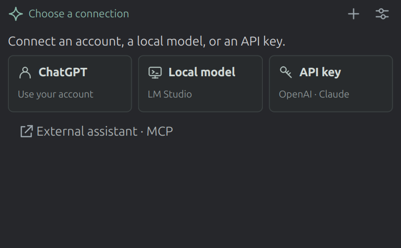

# AI / MCP integration

Serpentine3D ships an [MCP](https://modelcontextprotocol.io) server so AI
assistants can drive the modeller: create geometry, run any command,
inspect and screenshot the scene.

<figure markdown="span">
  { width="1100" }
  <figcaption>Commands, Python drafts, and the assistant share the bottom
  workspace. The ribs shown here were generated by the script.</figcaption>
</figure>

## In-app assistant

Open **Assistant** in the bottom workspace, then choose **Ask AI** beside the
shared input. **Command** returns to ordinary modelling commands. Each mode
keeps its own draft; opening a pane does not change the input destination.
The command history remains visible beside the conversation.

On first use, choose a connection directly in the Assistant pane. You can
use a ChatGPT account, an API key, or a model running in LM Studio. The
connection icon beside the model name lets you change this later. Choosing
a connection never sends your draft automatically.

{ width="600" }

### ChatGPT account

Serpentine uses the official [Codex app-server](https://learn.chatgpt.com/docs/app-server)
to connect your ChatGPT account. Install the [Codex CLI](https://developers.openai.com/codex/cli/)
before starting Serpentine. The app checks your PATH and common per-user
installation locations, including NVM installations used from the desktop.

1. Choose **ChatGPT** in the Assistant pane.
2. Reuse your existing Codex account, or choose **Sign in** to open the
   browser. Return to Serpentine after completing sign-in.
3. Select an available model and choose **Connect**.
4. Choose **Ask AI** and send a prompt, or click an example to draft one.

Codex manages authentication and account access. Serpentine does not copy
your account tokens into its settings. Disconnecting the Assistant leaves
your Codex account signed in. Account limits and model availability are
determined by your ChatGPT plan.

### LM Studio: run a model on your machine

1. Open LM Studio and start its local server in the Developer view.
2. In the Assistant pane, choose **Local** and enter the
   server URL, usually `http://127.0.0.1:1234`.
3. Choose **Discover**, select a model, and choose **Connect**. Qwen and Gemma can be used when
   installed in LM Studio; use a model trained for tool use to edit geometry.
4. Return to **Ask AI** and try: “Create a box 40 by 30 by 20.”

No cloud key or account is needed for LM Studio. Requests go to the server URL you
configure. With a loopback URL and a model served locally, inference stays
on this machine.

Model discovery uses LM Studio's capability information when available and
excludes embedding models. A vision model can inspect viewport screenshots;
a text-only model works with scene information and measurements. If the
server is unavailable or a model fails to load, the conversation shows the
error so you can correct the setup and retry.

LM Studio manages model loading, context size and CPU/GPU memory allocation.
If loading fails for lack of GPU memory, lower GPU offload or context size
there. Serpentine does not change those settings.

### Cloud API keys

Choose **API key**, select **OpenAI** or **Anthropic**, supply a key, and
select a model before choosing **Connect**. You can also set
`OPENAI_API_KEY` or `ANTHROPIC_API_KEY` before launching the app.
Environment keys take precedence over keys entered in the app and are not
copied into its configuration. Entered keys are saved in your Serpentine
configuration; each provider uses only its own key.

Cloud requests send your conversation and requested scene information to
the provider you selected. An API key is never sent to your LM Studio server.

API usage is billed separately from a ChatGPT or Claude subscription.
Anthropic does not offer Claude subscription sign-in for third-party
applications without prior approval. To use an existing signed-in Claude
client, connect it to Serpentine through MCP below.

### Working alongside a drawing command

You can ask a question while a command is waiting for a point or another
answer. An AI action that conflicts with that command must wait until you
finish or cancel it. Switching input modes preserves your unfinished answer.

**Stop** cancels the current assistant turn. It does not undo geometry that
has already been created; use the usual Undo command for completed changes.
Changing models during a turn applies to the next turn.

## Connect an external MCP client

Open the Assistant's connection options and choose **External assistant ·
MCP** to copy a configuration for the build you are running. Add it to your
external client's MCP settings and keep the Serpentine GUI open. This lets
an assistant you already use work on the scene, without configuring an
in-app model connection.

For an installed Linux AppImage, the configuration looks like this:

```json
{
  "mcpServers": {
    "serpentine3d": {
      "command": "/home/your-user/Applications/Serpentine3D.AppImage",
      "args": ["--mcp"]
    }
  }
}
```

The helper uses the original AppImage path so the configuration remains
valid after the application closes or updates. It does not use the
temporary directory where AppImages mount their bundled Python runtime.
`--mcp` starts only the stdio MCP server; start the GUI separately.

For a Python installation, you can also add the installed server directly —
for example, with Claude Code:

```bash
claude mcp add serpentine3d -- /path/to/.venv/bin/serp3d-mcp
```

The MCP server finds the running GUI through `~/.serpentine3d/rpc.port`.

## What the assistant can do

The server exposes these tools:

- `serp_create_curve`, `serp_create_surface`, `serp_boolean`,
  `serp_transform` — direct geometry with exact parameters
- `serp_command` — run **anything** a user could type, with scripted answers
  to its prompts
- `serp_scene_info`, `serp_measure`, `serp_screenshot` — see the scene (the
  screenshot returns an image of the viewport)
- `serp_select`, `serp_layers`, `serp_import`, `serp_export`, `serp_undo`,
  `serp_viewport` — selection, layers, files and the camera
- `serp_prepare_script` — open Python source as a new, unexecuted draft in
  the Script pane, ready for you to inspect and run

The combination of `serp_screenshot` and `serp_command` lets an assistant
inspect the current viewport and use the same modelling commands as you.
Geometry edits participate in the application's undo history. File exports
and other effects outside the document are not reversed by Undo.

External operations are labelled **MCP** in the common command history;
in-app assistant operations are labelled **AI**, and script runs **Script**.
MCP inspection remains available during a modelling prompt, while conflicting
edits report an error until you finish or cancel the command. Script handoff
preserves existing drafts and does not change the Command / Ask AI mode.

MCP is the interface for an external agent to control Serpentine. The
in-app assistant uses the same application operations and connects directly
to its selected model provider; it does not need a separate MCP client.

## The bridge

The running GUI opens a localhost-only JSON-RPC socket
(`~/.serpentine3d/rpc.port`); the MCP server (`serp3d-mcp`) connects to it. Set
`SERP3D_NO_RPC=1` to disable it.
