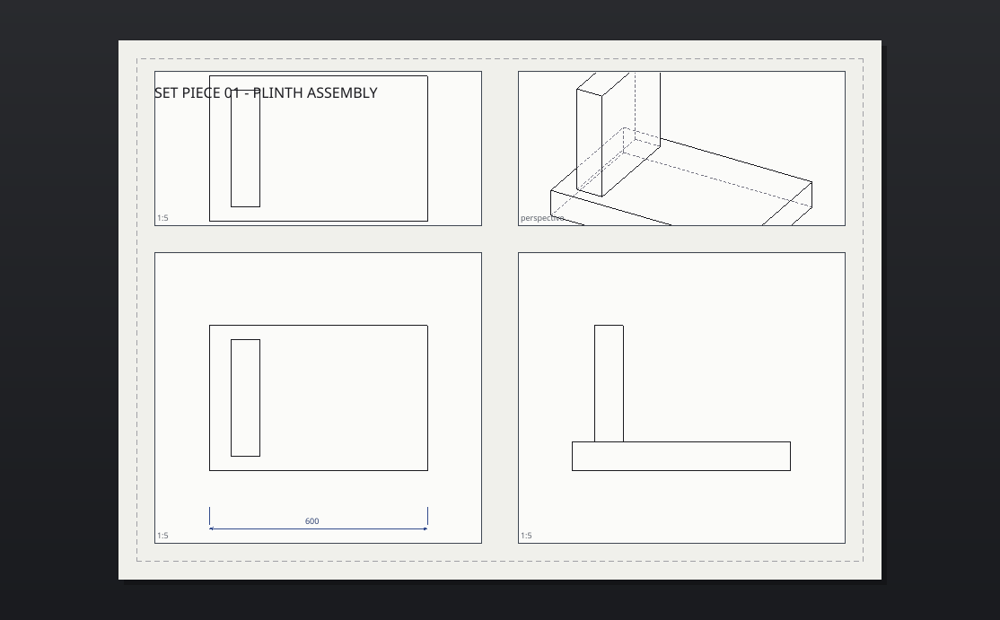

# Drafting & layouts

Serpentine3D has two spaces, like Rhino:

- **Model space** — one 3D world in real units.
- **Layouts** — paper sheets in millimetres, shown as tabs. Each sheet
  holds *detail views* (windows into the model), plus annotations that
  live on the paper.

<figure markdown="span">
  { width="720" }
  <figcaption>A sheet with plan / elevation / perspective details, dimensions
  and hidden-line linework — all live windows into the 3D model.</figcaption>
</figure>

## Layouts

| Command | Does |
|---|---|
| `layout` | create/list/rename/delete sheets (A4–A0, Letter, Tabloid) |
| `detail` | drag a new detail view onto the sheet |
| `detailscale` | set 1:N (accepts `1:50`, `2:1`, feet-inch scales) |
| `detailmode` | wireframe / shaded / hidden / technical linework |
| `detaillock` | freeze a detail's camera |
| `detailsection` | live section cut with hatching |

Double-click a detail to *enter* it (pan/zoom acts on the model);
click outside to leave. Selected details show corner grips for
resizing; drag the body to move it.

## Annotations

`text` (multiline with `\n`), `leader`, `dim`, `dimradius`,
`dimdiameter`, `dimangle`, `hatch` (corner picks or **Mode=Region** to
click inside linework), `scalebar`, `titleblock`, `sheetindex`,
`revision`.

Everything on a sheet is clickable: drag to move, Delete to remove,
`annotedit` to change text or hatch patterns. All of it is undoable.

**Associative dimensions**: a `dim` picked fully inside a detail
anchors to model space and re-projects when the detail pans or changes
scale. Hand-moving the dimension breaks the anchor on purpose.

**Styles**: `dimstyle` creates named text/arrow sizes shared by the
document (`Standard`, `Small`, `Heading` are built in).

## Output

- `exportpdf` — vector linework, raster shaded views, all sheets or one.
- `exportsvg` — per-sheet vector output.
- `make2d` — flatten the model's hidden-line drawing into model-space
  curves.
