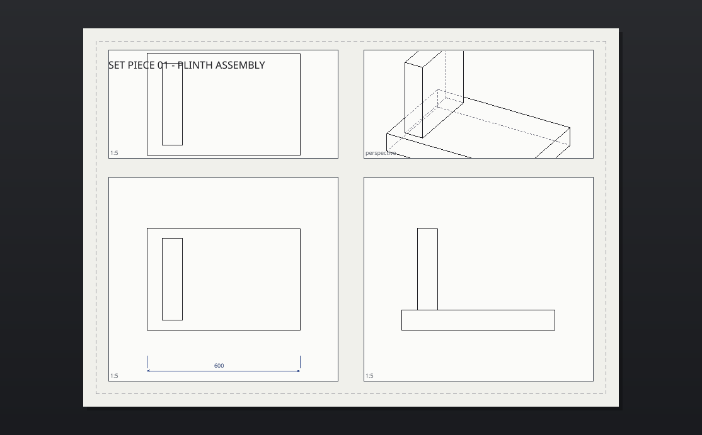

# Drafting & layouts

Serpentine3D has two spaces, like Rhino:

- **Model space** — one 3D world in real units.
- **Layouts** — paper sheets in millimetres, shown as tabs. Each sheet
  holds *detail views* (windows into the model), plus annotations that
  live on the paper.

The tab strip along the bottom switches workspaces. **Model** holds the
panes you model in; a sheet opens as the sheet, filling the viewport area.
Each tab remembers the arrangement of panes you left it in, splitters
included, and Properties, Layers and Display stay where you put them
throughout.

A space belongs to each pane as well, so a pane's own title menu lists
Model and every sheet in the drawing. Point one pane at a sheet and leave
the others on the model when you want the drawing and the thing it draws
side by side. Rhino makes you leave model space to look at a sheet.

<figure markdown="span">
  { width="720" }
  <figcaption>A sheet with plan / elevation / perspective details, dimensions
  and hidden-line linework — all live windows into the 3D model.</figcaption>
</figure>

## Layouts

| Command | Does |
|---|---|
| `layout` | create/list/rename/delete sheets (A4–A0, Letter, Tabloid) |
| `detail` | drag a new detail view onto the sheet |
| `detailscale` | set 1:N (accepts `1:50`, `2:1`, feet-inch scales) |
| `detailmode` | wireframe / shaded / hidden / technical linework |
| `detaillock` | freeze a detail's camera |
| `detailsection` | live section cut with hatching |

Run `detail` and click two opposite corners on the sheet. The model appears
inside the frame while you choose the second corner. The first detail uses
**Top, 1:100**; later details reuse the last successfully placed view and scale
for the current window.

The **View** and **Scale** command options are available at either corner.
Changing a setting returns you to placement without losing the first corner.
The scale stays fixed as you resize the frame. Choose **Fit** to fit the model
automatically as the rectangle changes; choose **Scale** to return to a fixed
scale. Escape cancels placement. The finished detail stays selected so you can
adjust its view and scale in **Properties**.

Double-click a detail to *enter* it (pan/zoom acts on the model);
click outside to leave. Selected details show corner grips for
resizing; drag the body to move it.

Anything picked on a sheet also gets a gumball: an X arrow, a Y arrow
and a pad that takes both at once. Drag a handle to move everything
picked, or type a distance to move it exactly that far. Hold Alt while
dragging an arrow or the pad to move a duplicate. Hold Shift while dragging
the pad on selected text to scale it uniformly about its visible centre.
Locked details stay where they are. Step into a detail and the gumball goes
back to holding the model objects inside it. There, or in model space,
Shift-drag a plane pad to scale equally along its two coloured axes while
leaving the axis normal to the pad unchanged. Alt+Shift makes and scales a
copy.

## Annotations

`text`, `leader`, `dim`, `dimradius`,
`dimdiameter`, `dimangle`, `hatch` (corner picks or **Mode=Region** to
click inside linework), `scalebar`, `titleblock`, `sheetindex`,
`revision`.

Everything on a sheet is clickable: drag to move, Delete to remove,
`annotedit` to change text or hatch patterns. All of it is undoable.

**Associative dimensions**: a `dim` picked fully inside a detail
anchors to model space and re-projects when the detail pans or changes
scale. Hand-moving the dimension breaks the anchor on purpose.

**Styles**: `dimstyle` creates named text/arrow sizes shared by the
document (`Standard`, `Small`, `Heading` are built in).

## Text and lettering

Use `text` for a layout note or `textobject` for lettering in the model.
Click the baseline position, then type multiple lines directly beside the text
in the drawing. Press Escape or click back in the drawing to finish.
Double-click existing text to edit it in place, or use the live **Content**
field in Properties. Font family and style, letter height and left, centre or
right alignment are available there without opening another window. Text edits
support Undo and Redo.

Letter height measures capital letters: model lettering uses the document's
units, and layout notes use paper millimetres. Each line aligns to the picked
baseline origin. Font metrics determine the spacing between lines.

Keep model lettering as **Editable text** to change its words and formatting
later. Place it on the active CPlane, a selected planar face or a plane facing
the current view. **Look at text** temporarily turns the camera square to an
angled text plane while editing and restores the previous view afterward; it
does not move the object. Placement survives moving, rotating, scaling, saving
and Undo, and saved geometry preserves its appearance when reopening the file.
Editable model text snaps cleanly at its baseline insertion point, four
oriented corners, four edge midpoints and centre. These references follow the
text plane when the object moves or rotates; converted curves expose their
ordinary outline snaps instead. Layout notes expose the same references in
paper space, with a high-contrast square marker at the insertion point and
corners. The selection rectangle and snap bounds are identical and follow the
actual font, alignment and named annotation style drawn on the sheet.

Choose **Curves**, **Planar surfaces** or **Solid** in Properties when you need
ordinary modelling geometry. Curves and surfaces are grouped by default, so
selecting one contour selects the whole string; use `ungroup` to work with
individual pieces. Every output preserves the counters in letters such as B,
O and R. Solid output adds a positive depth along the text plane normal and is
capped. Conversion is one Undo step; geometry output no longer retains editable
words or font settings.

Native documents and PDF output retain the formatted notes. DXF note export
still uses plain text and does not retain the new font, style or alignment settings.

## Output

- `exportpdf` — vector linework, raster shaded views, all sheets or one.
- `exportsvg` — per-sheet vector output.
- `make2d` — flatten the model's hidden-line drawing into model-space
  curves.
