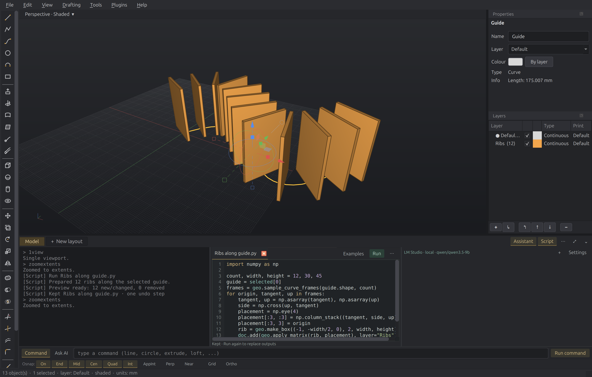

# Commands, AI, and scripts

The bottom workspace keeps command history, the assistant, and Python beside
one another. Model and drawing-layout tabs remain on the strip above it.

<figure markdown="span">
  { width="1100" }
  <figcaption>A Python script creates ribs along the selected guide. History,
  code, and the assistant remain visible together.</figcaption>
</figure>

## Choose where your input goes

Use **Command** for modeling commands and their prompts. Completion, command
history, and the usual Enter/Space behavior continue to work here.

Choose **Ask AI** to write to the assistant. The input changes colour and the
button changes to **Send to AI**. Enter sends your message; Shift+Enter adds a
new line. **Alt+/** switches between the two destinations.

Each destination keeps its own draft. You can start answering a command's
point prompt, switch to AI to ask a question, then return to the same command
and unfinished coordinates.

Opening, closing, or reading an assistant pane does **not** change the input
destination. Check the selected mode and send-button label before submitting.

## Arrange the workspace

- **Assistant** and **Script** independently show or hide their panes.
- Drag the vertical dividers to give a pane more width.
- **⋯ (Arrange workspace)** on the model/layout strip changes the order of
  the optional panes or resets their widths.
- Drag the separator above the workspace to change its height.
- **⤢ (Expand workspace)** gives the workspace more room for sustained work.
- **Collapse workspace** hides the panes while keeping the input and model/layout
  tabs available. **Restore workspace** brings the panes back.

Command history stays on the left when the workspace is expanded. Your pane
visibility, order, and widths are remembered between window sessions.

**View → Assistant** (or the `ai` command) and **Tools → Script Editor**
(++ctrl+grave++) also reveal these panes. They operate on the same document as the
viewport.

## Viewport display settings

Open a viewport's title dropdown, such as **Perspective · Shaded**, for its
view and display options. **Display settings…** opens the surface-edge and
isocurve controls for that viewport. The settings no longer occupy a
permanent dock beside Properties and Layers.

See [Script & automate](scripting.md) for Python and
[Drive it with AI](ai-mcp.md) for assistant and MCP setup.
