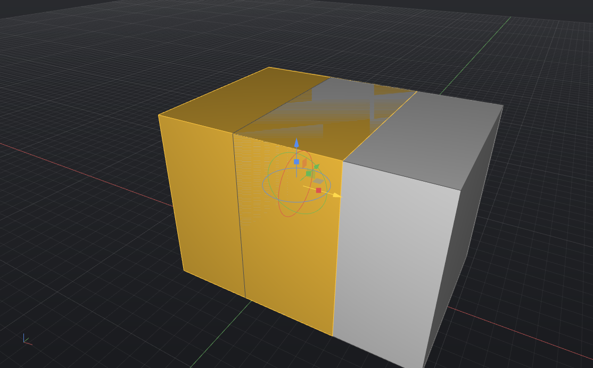

# Keyboard & mouse

Serpentine3D is command-line first, but the mouse and shortcuts cover
navigation, selection and the common operations. Everything here is
remappable in *Settings → Keyboard* and *Settings → Mouse*.

## Navigation

| Input | Action |
|---|---|
| **Middle-mouse drag** | Orbit |
| **Shift + middle-drag** | Pan |
| **Scroll wheel** | Zoom (anchors on the cursor) |
| ++f1++ / ++f2++ / ++f3++ / ++f4++ | Top / Front / Right / Perspective |
| ++ctrl+e++ | Zoom to fit (extents) |
| ++f7++ | Toggle grid |

Orbit can be moved to the **right** mouse button in *Settings → Mouse* (a
common Rhino preference).

## Files & editing

| Shortcut | Action |
|---|---|
| ++ctrl+n++ / ++ctrl+o++ / ++ctrl+s++ | New / Open / Save |
| ++ctrl+z++ / ++ctrl+y++ | Undo / Redo |
| ++ctrl+a++ | Select all |
| ++delete++ | Delete selection |
| ++ctrl+p++ | Export the current sheet to PDF |
| ++ctrl+comma++ | Settings |

## Selection

- **Click** to select; **Shift-click** adds, **Ctrl-click** removes; click
  empty space to deselect.
- **Box selection**: drag **left→right** for a *window* (fully enclosed, gold
  box); **right→left** for a *crossing* (anything touched, white box).
- **Object snaps** — end, mid, center, quadrant, intersection, perpendicular,
  nearest — toggle on the **osnap bar** under the command line.

## Control points & sub-objects

<figure markdown="span">
  { width="640" }
  <figcaption>The gumball: arrows move, arcs rotate, knobs scale — and
  ++ctrl+shift++-click a face for push/pull.</figcaption>
</figure>

| Shortcut | Action |
|---|---|
| ++f10++ / ++f11++ | Show / hide control points (curves *and* surfaces) |
| ++ctrl+shift++ + click | Pick a **face** (push/pull) or **edge** (fillet) of a solid |
| Arrow keys | Nudge the selection along the construction plane (++shift++ ×10, ++ctrl++ ×0.1) |

## Command line

- **Tab** completes command names; **↑ / ↓** recall history.
- **Enter** on an empty line repeats the last command; a **right-click** in
  the viewport is Enter — it runs what you've typed or repeats the last
  command.
- Type command options inline (`cap=n`) or click the chips under the prompt.
- ++f1++ opens the searchable [command reference](commands.md) inside the app.
