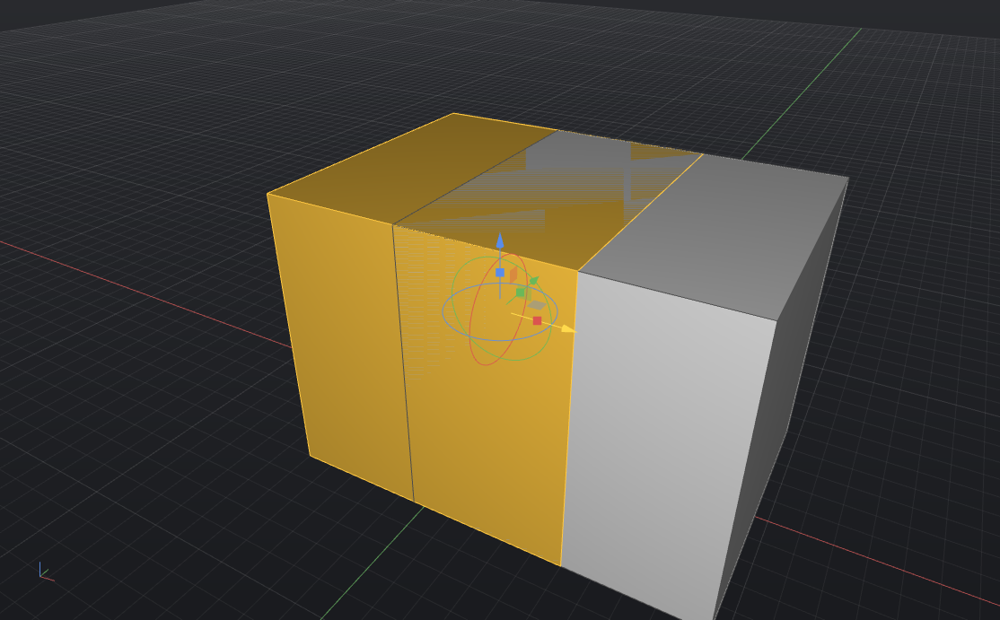

# Keyboard & mouse

Serpentine3D is command-line first, but the mouse and shortcuts cover
navigation, selection and the common operations. Everything here is
remappable in *Settings → Shortcuts* and *Settings → Mouse*.

## Navigation

| Input | Action |
|---|---|
| **Middle-mouse drag** | Orbit |
| **Shift + middle-drag** | Pan |
| **Scroll wheel** | Zoom (anchors on the cursor) |
| ++f1++ / ++f2++ / ++f3++ / ++f4++ | Top / Front / Right / Perspective |
| ++ctrl+e++ | Zoom to fit (extents) |
| ++f7++ | Toggle grid |

Orbit can be moved to the **right** mouse button in *Settings → Mouse* (a
common Rhino preference).

## Mouse chords

A mouse button held with modifiers can run any command. Add one in
*Settings → Shortcuts*, or write it into your settings file:

```json
"mouse": { "chords": { "ctrl+shift+mmb": "zoomselected" } }
```

The chord fires on a **click**, so a drag with the same keys held still
orbits and pans as before. Only the middle and right buttons can be bound —
the left one is busy selecting. Order and spelling don't matter:
`ctrl+shift+mmb`, `mmb+ctrl+shift` and `shift+ctrl+middle` are one binding.
Nothing is bound out of the box.

## Files & editing

| Shortcut | Action |
|---|---|
| ++ctrl+n++ / ++ctrl+o++ / ++ctrl+s++ | New / Open / Save |
| ++ctrl+z++ / ++ctrl+y++ | Undo / Redo |
| ++ctrl+a++ | Select all |
| ++delete++ | Delete selection |
| ++ctrl+p++ | Export the current sheet to PDF |
| ++ctrl+comma++ | Settings |

## Selection

- **Click** to select; **Shift-click** adds, **Ctrl-click** removes; click
  empty space to deselect.
- **Box selection**: drag **left→right** for a *window* (fully enclosed, gold
  box); **right→left** for a *crossing* (anything touched, white box).
- **Object snaps** — end, mid, center, quadrant, intersection, apparent
  intersection, perpendicular, nearest — toggle on the **osnap bar** under
  the command line. They keep working while a direction is held: the point
  lands on the locked line beside whatever the snap found.
- **AppInt** is the crossing you can see but cannot touch: where a rafter
  passes over a wall in a Top view the two never meet, so **Int** has
  nothing there, and **AppInt** gives you the point anyway, on whichever
  curve is nearer the camera. It belongs to the view you are looking
  through, so it moves when you orbit. Off until you switch it on.

## Control points & sub-objects

<figure markdown="span">
  { width="640" }
  <figcaption>The gumball: arrows move, arcs rotate, knobs scale — and
  ++ctrl+shift++-click a face for push/pull.</figcaption>
</figure>

| Shortcut | Action |
|---|---|
| ++f10++ / ++f11++ | Show / hide control points (curves *and* surfaces) |
| ++ctrl+shift++ + click | Pick a **face** (push/pull) or **edge** (fillet) of a solid |
| ++tab++ | While a command wants a point: lock the direction you're aiming in, then type the distance. ++tab++ again releases it |
| ++ctrl++ + click | While a command wants a point: stand a vertical up from the point you clicked, then type the height (Rhino's elevator mode) |
| ++ctrl+m++ | Give the viewport you're in the whole window; again puts the layout back. Double-clicking a viewport's title does the same |
| Arrow keys | Nudge the selection along the construction plane (++shift++ ×10, ++ctrl++ ×0.1) |

## Command line

- **Tab** completes command names, except while a command is waiting for a
  point, when it locks the direction instead; **↑ / ↓** recall history.
- **Enter** on an empty line repeats the last command; a **right-click** in
  the viewport is Enter — it runs what you've typed or repeats the last
  command. `delete` is never repeated, so a right-click after deleting
  something repeats whatever you were doing before it instead.
- Type command options inline (`cap=n`) or click the chips under the prompt.
- ++f1++ opens the searchable [command reference](commands.md) inside the app.
